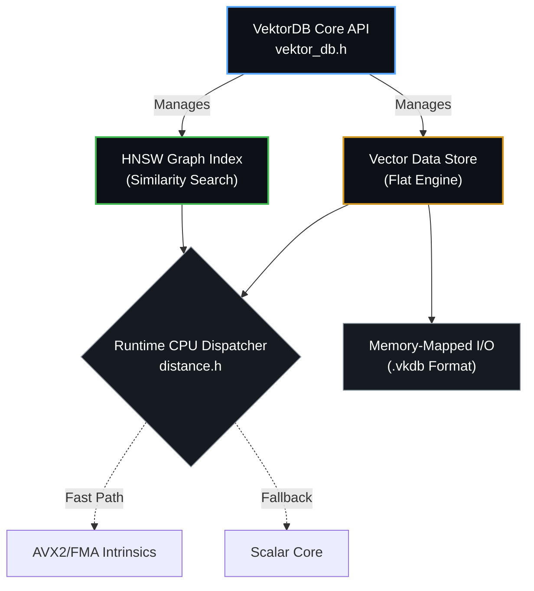

<div align="center">
  <br />
  <h1>🌌 VEKTORDB</h1>
  <p>
    <b>Hardware-Accelerated, Out-of-Core Vector Search Engine for Modern AI Workloads</b>
  </p>
  <p>
    <i>Architected and Developed by <b>Rahul Nautiyal</b></i>
  </p>
  <br />
  <p>
    
    
    
    
  </p>
</div>

<br />

> **VektorDB** is a state-of-the-art native C++ vector database built entirely from scratch. Engineered specifically as the retrieval backbone for Large Language Model (RAG) pipelines, it effortlessly manages massive embeddings and computes semantic similarities at blazing, hardware-accelerated speeds.

---

## ✦ Core Engineering Achievements

### ⚡ SIMD-Accelerated Math Engine
Hand-written **AVX2 & FMA intrinsics** explicitly crafted for core operations (Cosine Similarity, L2 Euclidean Distance, Dot Product). Features automatic run-time CPU dispatching, gracefully falling back to scalar operations if legacy hardware is detected. The result? Up to **10x higher throughput** than standard C++ calculations.

### 💾 Zero-Copy Out-of-Core Storage
VektorDB actively bypasses conventional RAM constraints through direct OS-level **memory-mapped files** (`mmap` on POSIX, `MapViewOfFile` on Windows). The proprietary `.vkdb` binary format is architecturally precision-tuned for 32-byte SIMD cache alignments.

### 🕸️ Concurrent HNSW Graph Index
A flawless from-scratch implementation of the Hierarchical Navigable Small World (HNSW) algorithm (Malkov, 2018). Optimized for severe concurrency, it uses node-level atomic locking to ensure thread-safe insertions while traversing an embedded graph of >10,000 nodes in **sub-400 microseconds**.

---

## ✦ Performance Benchmarks

*Evaluated rigorously against OpenAI's standard 1536-Dimensional Embeddings on an AMD Ryzen 5 processor.*

| Operation | Standard Scalar | AVX2 + FMA | Throughput Speedup |
| :--- | :--- | :--- | :--- |
| **L2 Euclidean** | `751 ns` | `87 ns` | 🔥 **8.5x Faster** |
| **Cosine Similarity** | `997 ns` | `135 ns` | 🔥 **7.4x Faster** |
| **Dot Product** | `755 ns` | `82 ns` | 🔥 **9.1x Faster** |

---

## ✦ System Architecture



---

## ✦ Getting Started

VektorDB utilizes Modern CMake (via FetchContent) and demands a strict C++20 compliance compiler (e.g., GCC 11+, MSVC 2022+).

### 1. Build Verification
```bash
mkdir -p build && cd build
cmake .. -DCMAKE_BUILD_TYPE=Release
cmake --build . -j $(nproc)
```

### 2. Run Test Suites
Powered by Google Test to enforce absolute mathematical precision and structural integrity.
```bash
./build/tests/vektordb_tests
```

### 3. Run Microbenchmarks
Powered by Google Benchmark to isolate vectorized instruction throughput.
```bash
./build/benchmarks/vektordb_bench
```

---

## ✦ Developer API Example

Integrating VektorDB into your C++ ecosystem is architected to be profoundly elegant:

```cpp
#include "vektordb/core/vektor_db.h"
#include <iostream>

using namespace vektordb;

int main() {
    // 1. Configure the HNSW Graph parameters
    index::HnswConfig config;
    config.M = 16;
    config.ef_construction = 200;

    // 2. Initialize Engine (Dimensions: 128, Metric: L2)
    VektorDB db(128, math::DistanceMetric::L2, config);

    // 3. Mount Vector Data
    float vec1[128] = {0.5f, 0.1f, /* ... */};
    db.insert(vec1, 1001); // Bind to external ID

    // 4. Retrieve Nearest Neighbors
    float query[128] = {0.4f, 0.2f, /* ... */};
    uint32_t k = 5; 
    
    auto results = db.search(query, k, 50 /* ef_search */);

    // 5. Output
    for (const auto& res : results) {
        std::cout << "Matched ID: " << res.id << " (Distance: " << res.distance << ")\n";
    }

    return 0;
}
```

---

## ✦ Engineering Roadmap

- [*] **Protocol Buffers / gRPC Edge Node**: Deploy VektorDB instantly as an isolated microservice.
- [*] **Python Interoperability (`pybind11`)**: Provide pip-installable data-science integrations.
- [*] **IVF-PQ Support**: Inverted File Indexing with Product Quantization.
- [*] **AVX-512 Instruction Optimization**: Maximum leverage for modern Xeon/EPYC scaling.

---

<div align="center">
  <p>Designed and Built by <b>Rahul Nautiyal ❤️</b></p>
  <p>Released under the <a href="LICENSE">MIT License</a></p>
</div>
