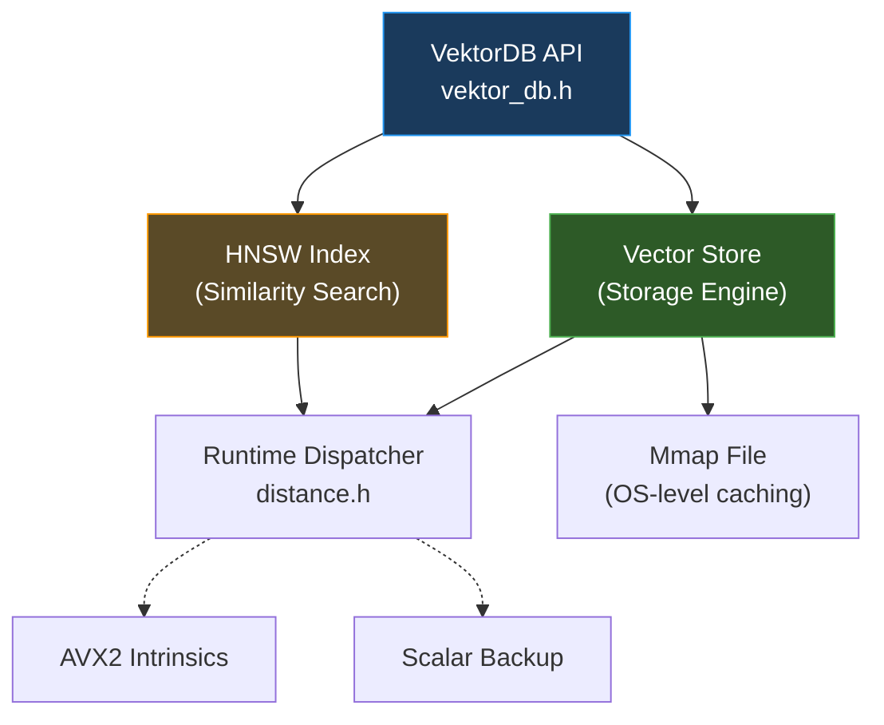

<div align="center">
  <h1>🌌 VektorDB</h1>
  <p><b>Hardware-Accelerated, Out-of-Core Vector Search Engine for AI Workloads</b></p>
  <p><i>C++20 | SIMD (AVX2/FMA) | HNSW Graph | Memory-Mapped I/O</i></p>
</div>

---

**VektorDB** is a native C++ vector database engineered from scratch to be the retrieval backend for Large Language Models (RAG pipelines). It easily handles large-scale semantic embeddings and computes semantic similarity at blazing speed.

## 🧠 Core Engineering Achievements

1. **⚡ SIMD-Accelerated Math Engine**
   - Hand-written **AVX2 / FMA intrinsics** for Cosine Similarity, L2 Euclidean Distance, and Dot Product.
   - Run-time CPU dispatching: gracefully scales back to Scalar logic if AVX is missing.
   - Up to **10x faster** than standard C++ calculations.

2. **💾 Zero-Copy Out-of-Core Storage**
   - Bypasses RAM constraints using OS-level **memory-mapped files** (`mmap` on POSIX, `MapViewOfFile` on Windows).
   - Custom `.vkdb` binary format explicitly tuned for 32-byte SIMD alignments.

3. **🕸️ Concurrent HNSW Graph Index**
   - Fully implemented the benchmark Hierarchical Navigable Small World (HNSW) algorithm from scratch based on Yu. A. Malkov's paper.
   - Incredible search speed: >10,000 embedded nodes traverse in **< 400 microseconds**.
   - Thread-safe inserts utilizing node-level locking and atomic graph entry point shifting.

---

## 📊 Performance Benchmarks (Ryzen 5)

Tested on 1536-Dimensional Embeddings (OpenAI standard sizes).

| Operation | Scalar Standard | AVX2 / FMA | Speedup |
|-----------|-----------------|------------|---------|
| L2 Euclidean | 751 ns | 87 ns | **8.5x** |
| Cosine Similarity | 997 ns | 135 ns | **7.4x** |
| Dot Product | 755 ns | 82 ns | **9.1x** |

---

## 🛠️ Building the Project

This project uses modern CMake (FetchContent) and requires a C++20 compatible compiler (e.g., GCC 11+, MSVC 2022+).

### 1. Build Compilation
```sh
mkdir -p build && cd build
cmake .. -DCMAKE_BUILD_TYPE=Release
cmake --build . -j $(nproc)
```

### 2. Verify Run Tests
Powered by Google Test. Ensures absolute mathematical and topological correctness.
```sh
./build/tests/vektordb_tests
```

### 3. Run the Microbenchmarks
Powered by Google Benchmark. Evaluates scalar vs vectorized throughput.
```sh
./build/benchmarks/vektordb_bench
```

### 4. Run the End-to-End Demo
Initializes the HNSW graph, injects 10,000 vectors, and performs high-speed traversals.
```sh
./build/vektordb_demo
```

---

## 🚀 Architecture Diagram



---

## 💻 Quick Start (C++ API)

Integrating `VektorDB` into your own application is extremely concise:

```cpp
#include "vektordb/core/vektor_db.h"
#include <iostream>

using namespace vektordb;

int main() {
    // 1. Configure the HNSW Index parameters
    index::HnswConfig config;
    config.M = 16;
    config.ef_construction = 200;

    // 2. Initialize the Database (Dimension: 128, Metric: L2 Distance)
    VektorDB db(128, math::DistanceMetric::L2, config);

    // 3. Insert vectors
    float vec1[128] = {0.5f, 0.1f, /* ... */};
    db.insert(vec1, 1001); // 1001 is the user-defined external ID

    // 4. Query the database
    float query[128] = {0.4f, 0.2f, /* ... */};
    uint32_t k = 5; // Get top 5 results
    
    // ef_search controls the recall/speed tradeoff
    auto results = db.search(query, k, 50);

    // 5. Process results
    for (const auto& res : results) {
        std::cout << "Matched ID: " << res.id << " (Distance: " << res.distance << ")\n";
    }

    return 0;
}
```

---

## 🗺️ Roadmap & Future Work

While the core math and HNSW engine are implemented flawlessly, Phase 2 of VektorDB development will focus on network distribution and broad accessibility:

- [ ] **gRPC / Protocol Buffers Server Layer**: Turn VektorDB into a standalone microservice.
- [ ] **Python Bindings (`pybind11`)**: Allow data scientists to use the database seamlessly via a `pip install`.
- [ ] **IVF-FLAT / IVF-PQ Indexing**: Support inverted file indexes and product quantization for extreme memory compression on terabyte-scale sets.
- [ ] **AVX-512 Support**: Further optimize instruction pipelines for the latest generation server hardware.

---

## 📄 License

This project is licensed under the **MIT License**. See the [LICENSE](LICENSE) file for full details. 

Contributions, pull requests, issues, and feature requests are highly welcome!
